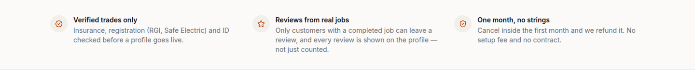
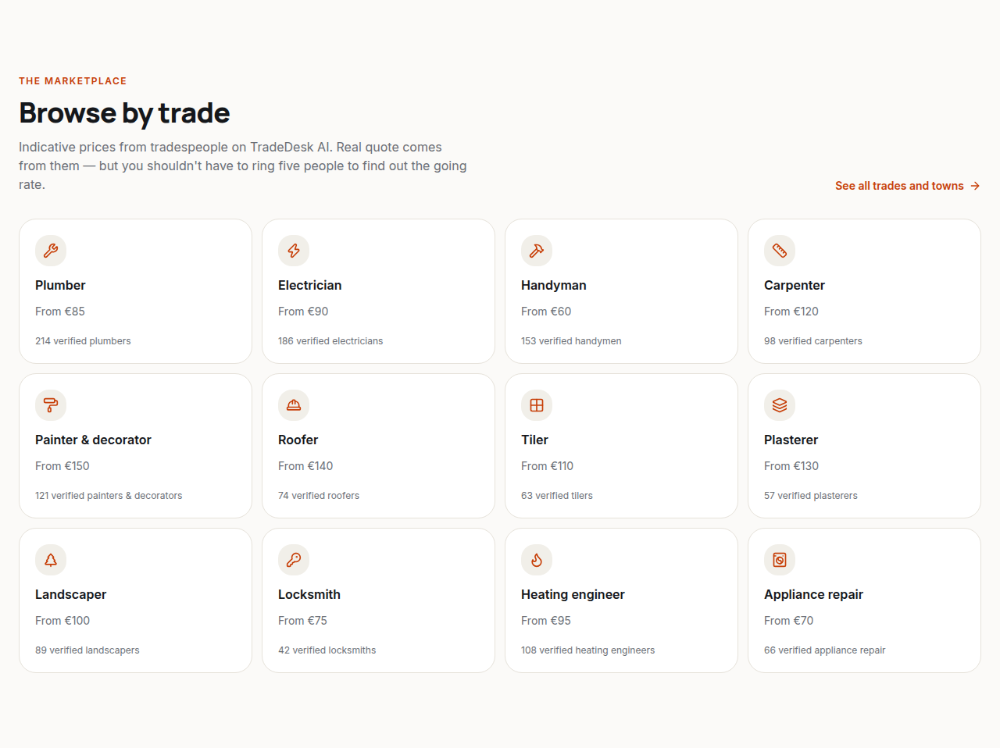
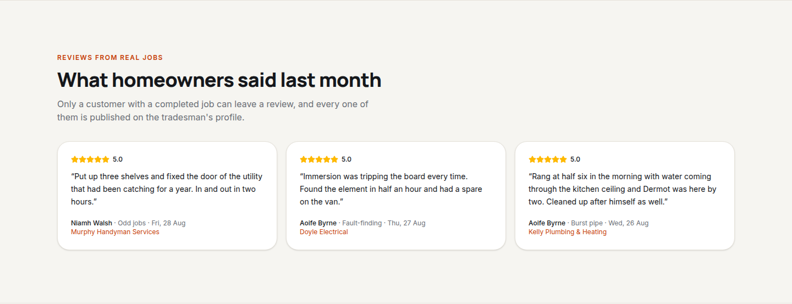
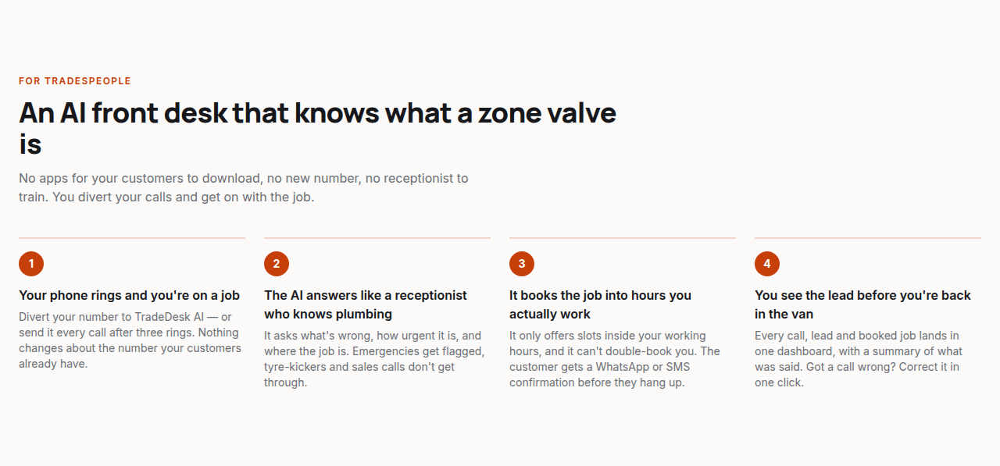
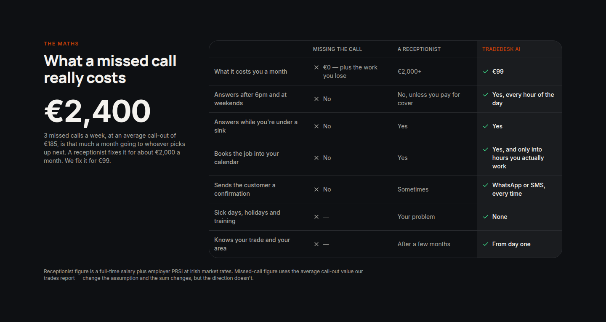
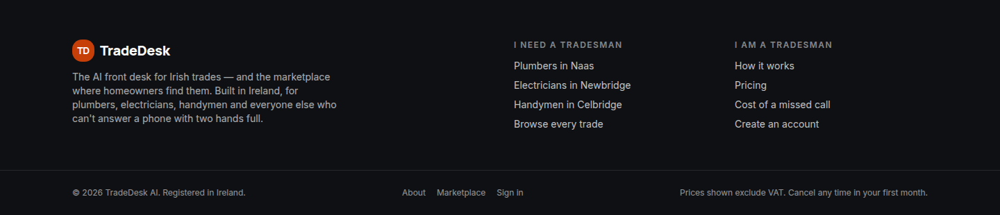
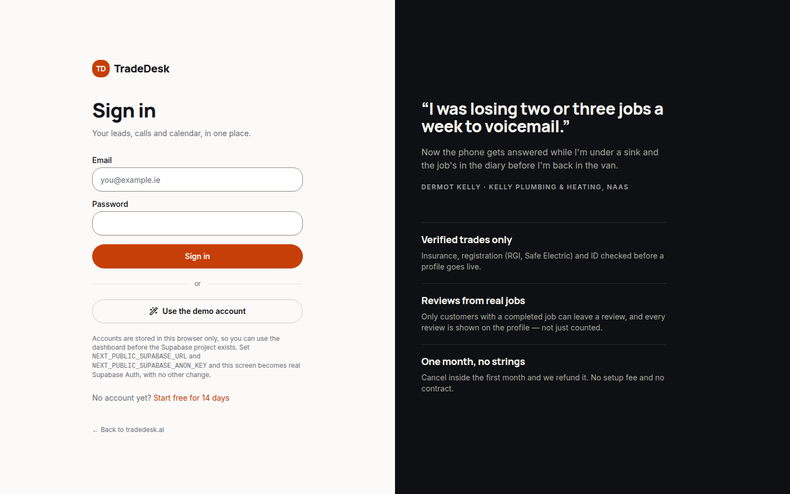
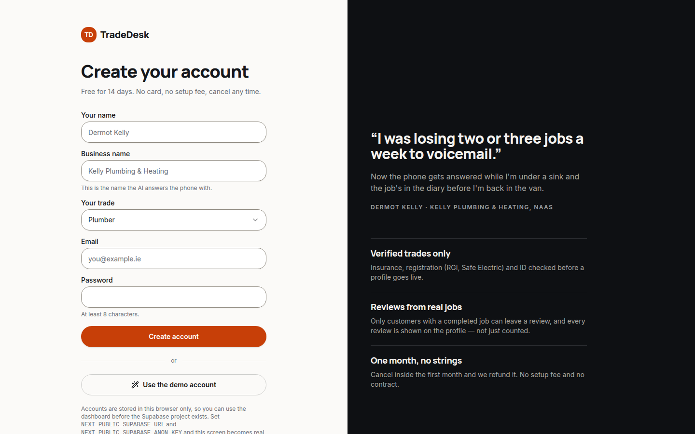
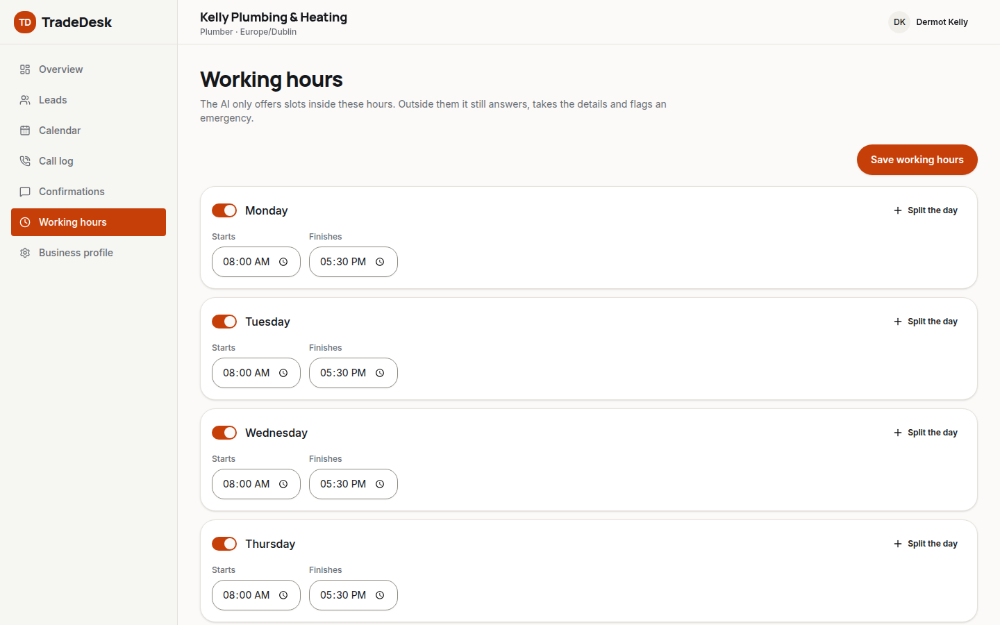
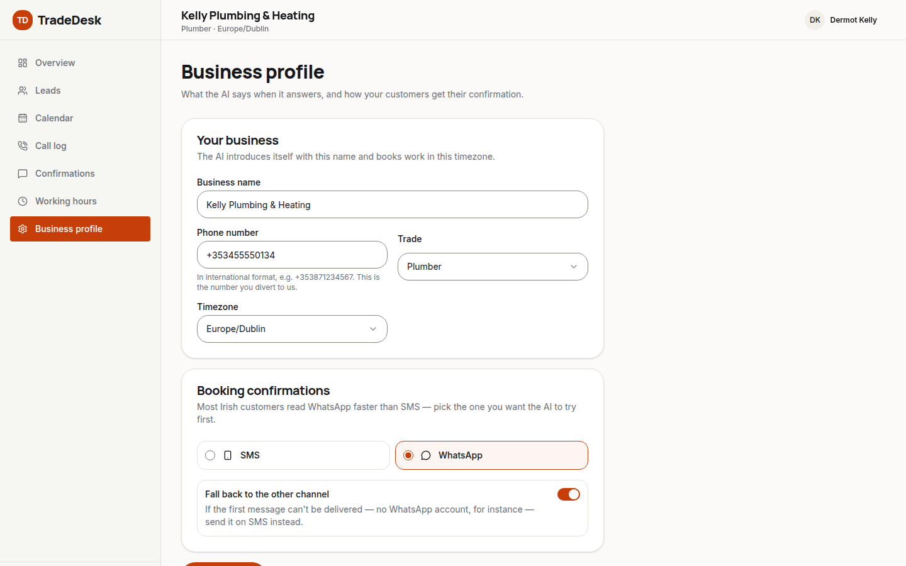

# Visual tour

Every screen in the app, screenshotted, next to the file that renders it. Start here if you want to change something and don't yet know where it lives.

Screenshots are taken against mock data at 1440×900 — see the main [README](../README.md) for how to run the app yourself. The hero photo below renders as a plain dark fallback colour in these shots because the real photo (`public/images/hero-tradesman.jpg`) is a local-only file, not committed to the repo — see [`public/images/README.md`](../public/images/README.md).

## Table of contents

- [Marketing site](#marketing-site)
- [About page](#about-page)
- [Sign in / sign up](#sign-in--sign-up)
- [Marketplace](#marketplace)
- [Tradesman dashboard](#tradesman-dashboard)

---

## Marketing site

Composed in [`app/page.tsx`](../app/page.tsx), section by section:

### Hero

**File:** [`components/marketing/hero.tsx`](../components/marketing/hero.tsx)

Full-bleed photo hero (Booksy-style): a transparent header over a darkened photo, a centred headline, one search pill, and a row of trade chips. The animated tool-assembly badge top-right is [`components/marketing/tool-badge.tsx`](../components/marketing/tool-badge.tsx) — a Canvas 2D particle animation that assembles into a spanner/screwdriver emblem, then holds with a soft glow (static on `prefers-reduced-motion`). The search pill itself is [`components/marketing/hero-search.tsx`](../components/marketing/hero-search.tsx); the transparent nav bar is [`components/site/site-header.tsx`](../components/site/site-header.tsx) (`overlay` prop).

### Trust strip

**File:** [`components/marketing/trust-strip.tsx`](../components/marketing/trust-strip.tsx)

A row of small credibility markers directly under the hero.

### Category grid

**File:** [`components/marketing/category-grid.tsx`](../components/marketing/category-grid.tsx)

Browsable trade categories with indicative prices, sourced from [`getCategories()`](../lib/api/marketplace.ts). Icons resolved by [`components/marketing/category-icon.tsx`](../components/marketing/category-icon.tsx).

### Reviews

**File:** [`components/marketing/reviews.tsx`](../components/marketing/reviews.tsx)

Real, attributed reviews pulled via [`getFeaturedReviews()`](../lib/api/marketplace.ts); star rendering is [`components/rating-stars.tsx`](../components/rating-stars.tsx).

### How it works

**File:** [`components/marketing/how-it-works.tsx`](../components/marketing/how-it-works.tsx)

### Cost comparison

**File:** [`components/marketing/cost-comparison.tsx`](../components/marketing/cost-comparison.tsx)

A dark `.band-dark` section (defined in [`app/globals.css`](../app/globals.css)) showing the cost of a missed call against TradeDesk AI.

### Pricing

**File:** [`components/marketing/pricing.tsx`](../components/marketing/pricing.tsx)

### FAQ

**File:** [`components/marketing/faq.tsx`](../components/marketing/faq.tsx)

Built on the [`components/ui/accordion.tsx`](../components/ui/accordion.tsx) primitive.

### CTA band + footer

**Files:** [`components/marketing/cta-band.tsx`](../components/marketing/cta-band.tsx) · [`components/site/site-footer.tsx`](../components/site/site-footer.tsx)

---

## About page

**Route:** [`app/about/page.tsx`](../app/about/page.tsx) · content in [`lib/marketing.ts`](../lib/marketing.ts) (`aboutStats`, `aboutStoryBlocks`, `companyValues`, `teamMembers`)

Mission statement and headline stats. The grey box is `PhotoBlock`'s fallback — same pattern as the hero, waiting on `public/images/about-team.jpg` / `about-office.jpg`.

Alternating story blocks (`aboutStoryBlocks`) and, further down the page, the values checklist and team grid (`TeamAvatar` initials tiles) — not pictured above the fold here, but defined in the same file.

---

## Sign in / sign up

**Files:** [`app/login/page.tsx`](../app/login/page.tsx), [`app/signup/page.tsx`](../app/signup/page.tsx), both built from [`components/auth/auth-layout.tsx`](../components/auth/auth-layout.tsx) (the split panel) and [`components/auth/auth-panel.tsx`](../components/auth/auth-panel.tsx) (the form itself, backed by [`components/auth/demo-auth-form.tsx`](../components/auth/demo-auth-form.tsx)).

Auth is demo-only today: accounts live in browser `localStorage` via [`lib/api/mock/auth-store.ts`](../lib/api/mock/auth-store.ts). Set the two Supabase env vars and the same screens switch to real Supabase Auth UI with no component change — see `isDemoAuth` in [`lib/api/auth.ts`](../lib/api/auth.ts).

---

## Marketplace

### Browse index

**File:** [`app/find/page.tsx`](../app/find/page.tsx)

Reuses `CategoryGrid`, `HeroSearch` and `TrustStrip` from the homepage.

### Search results

**File:** [`app/find/[category]/[location]/page.tsx`](../app/find/[category]/[location]/page.tsx)

Filter bar plus the results list, rendered by [`components/marketplace/search-results.tsx`](../components/marketplace/search-results.tsx) and [`components/marketplace/listing-card.tsx`](../components/marketplace/listing-card.tsx) per profile.

### Public tradesman profile

**File:** [`app/pro/[slug]/page.tsx`](../app/pro/[slug]/page.tsx)

Services, prices and reviews for one tradesman ([`getMarketplaceProfile()`](../lib/api/marketplace.ts)), the trust badges via [`components/marketplace/trust-block.tsx`](../components/marketplace/trust-block.tsx), and the callback form via [`components/marketplace/contact-form.tsx`](../components/marketplace/contact-form.tsx).

---

## Tradesman dashboard

Every dashboard route is gated on demo (or Supabase) auth and shares [`components/dashboard/dashboard-shell.tsx`](../components/dashboard/dashboard-shell.tsx) (the sidebar nav, defined in [`components/dashboard/dashboard-nav.ts`](../components/dashboard/dashboard-nav.ts)) and [`components/dashboard/page-header.tsx`](../components/dashboard/page-header.tsx) for the page title row.

### Overview

**File:** [`app/dashboard/page.tsx`](../app/dashboard/page.tsx)

Week counters plus the "Needs you" queue — [`components/dashboard/attention-list.tsx`](../components/dashboard/attention-list.tsx) — surfacing failed calls, stuck confirmations and untouched leads. The amber warning cards use the `--warn-*` tokens from `app/globals.css`, not a hardcoded colour.

### Leads

**File:** [`app/dashboard/leads/page.tsx`](../app/dashboard/leads/page.tsx)

Filterable lead list; row detail opens [`components/dashboard/lead-detail-dialog.tsx`](../components/dashboard/lead-detail-dialog.tsx). Status pills are [`components/status-badge.tsx`](../components/status-badge.tsx).

### Calendar

**File:** [`app/dashboard/calendar/page.tsx`](../app/dashboard/calendar/page.tsx)

Week view of booked jobs against working hours; job detail opens [`components/dashboard/job-detail-dialog.tsx`](../components/dashboard/job-detail-dialog.tsx).

### Call log

**File:** [`app/dashboard/calls/page.tsx`](../app/dashboard/calls/page.tsx)

The AI's call outcomes and summaries, with a one-click correction via [`components/dashboard/reclassify-call-dialog.tsx`](../components/dashboard/reclassify-call-dialog.tsx).

### Confirmations

**File:** [`app/dashboard/messages/page.tsx`](../app/dashboard/messages/page.tsx)

Booking confirmations sent by SMS/WhatsApp, including failures with a re-send-on-the-other-channel action.

### Working hours

**File:** [`app/dashboard/availability/page.tsx`](../app/dashboard/availability/page.tsx)

Weekly hours editor with split-day support.

### Business profile

**File:** [`app/dashboard/settings/page.tsx`](../app/dashboard/settings/page.tsx)

Business profile fields and confirmation-channel preference.

---

## Shared building blocks

Everything above is built from the same small set of primitives — worth knowing before adding a new screen:

| Piece                                                               | File                                                                |
| ------------------------------------------------------------------- | ------------------------------------------------------------------- |
| Design tokens (colour, radius, `.band-dark`, `.display`, `.kicker`) | [`app/globals.css`](../app/globals.css)                             |
| Button, Card, Badge, Input, Select, Dialog, Sheet, Alert, …         | [`components/ui/`](../components/ui)                                |
| Typed API surface (what every component is allowed to call)         | [`lib/api/types.ts`](../lib/api/types.ts), [`lib/api/`](../lib/api) |
| Mock fixtures behind that API                                       | [`lib/api/mock/`](../lib/api/mock)                                  |
| Money/date/phone formatting                                         | [`lib/format.ts`](../lib/format.ts)                                 |
